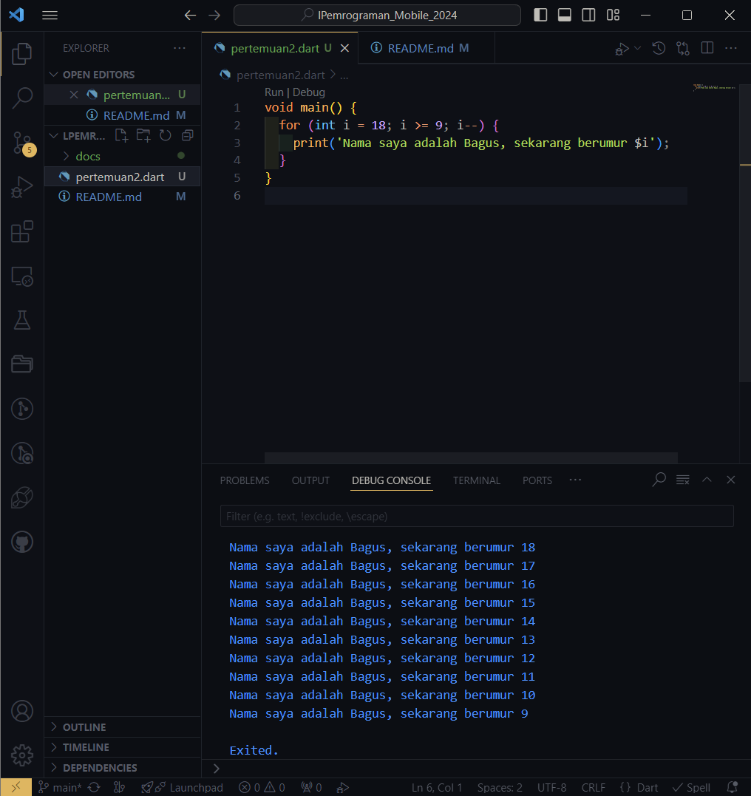

# Pemrograman_Mobile_2024-Pertemuan 2
Project Hello World

NIM     : 2241720223

NAMA    : Sukma Bagus Wahasdwika

# SOAL 1
Modifikasilah kode pada baris 3 di VS Code atau Editor Code favorit Anda berikut ini agar mendapatkan keluaran (output) sesuai yang diminta!

Tampilan screenshot

# SOAL 2
Mengapa sangat penting untuk memahami bahasa pemrograman Dart sebelum kita menggunakan framework Flutter ? Jelaskan!

Jawab :
Flutter menggunakan bahasa pemrograman Dart untuk menulis semua komponen, widget, dan logika aplikasi. Oleh karena itu, pemahaman mendalam tentang Dart sangat penting dalam pengembangan aplikasi Flutter.

# SOAL 3
Rangkumlah materi dari codelab ini menjadi poin-poin penting yang dapat Anda gunakan untuk membantu proses pengembangan aplikasi mobile menggunakan framework Flutter.

Jawab:
Dart adalah bahasa pemrograman yang dikembangkan oleh Google dan banyak digunakan, terutama dalam pengembangan aplikasi Flutter. Dibuat untuk meningkatkan produktivitas dengan kinerja tinggi, Dart digunakan untuk aplikasi mobile, web, dan server-side.

Dirilis pada 2011 sebagai alternatif JavaScript, Dart kini menjadi bahasa utama dalam Flutter. Dart memiliki dua jenis kompilasi: Just-In-Time (JIT) untuk pengembangan cepat dan Ahead-Of-Time (AOT) untuk performa optimal dalam produksi. JIT mendukung hot-reload, sedangkan AOT menghasilkan kode native yang cepat.

Dart adalah bahasa berorientasi objek dengan sintaks yang mirip dengan JavaScript, Java, dan C#, serta mendukung konsep OOP seperti inheritance, classes, dan interfaces.
