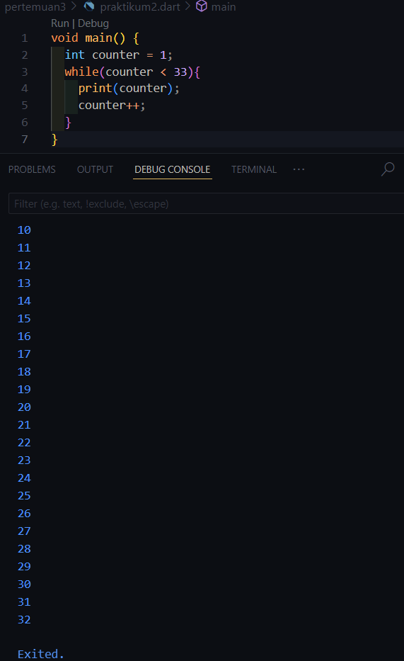
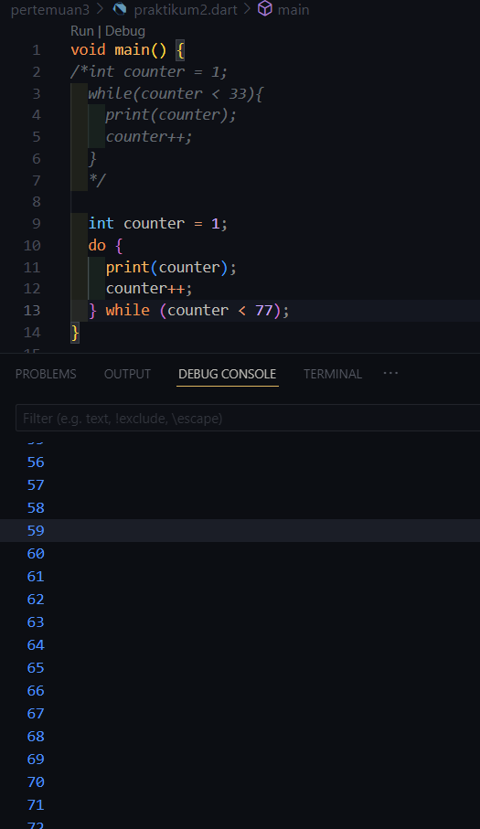
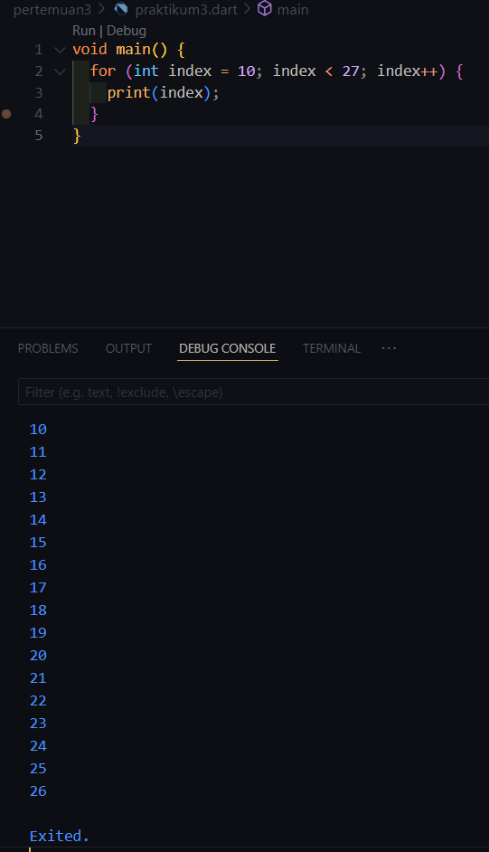
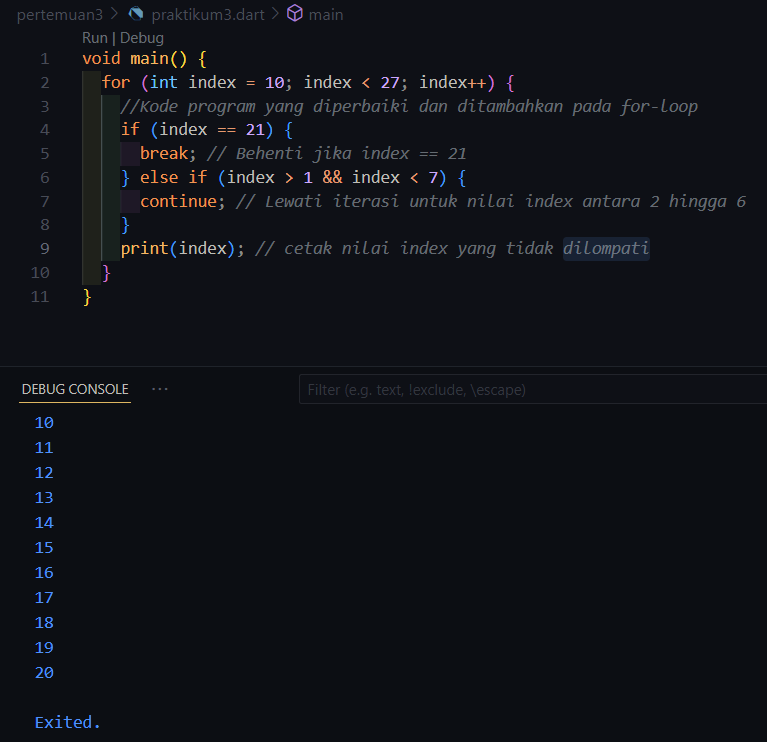

# Pemrograman_Mobile_2024-Pertemuan 3
**Pengantar Bahasa Pemrograman Dart - Bagian 2**

NIM     : 2241720223

NAMA    : Sukma Bagus Wahasdwika

# Praktikum 1 - Menerapkan Control Flows ("if/else")
1. **Langkah 1:**

2. **Langkah 2:**

Hasil eksekusi ada di langkah 1 yang menunjukkan bahwa output adalah "Test2 Test2 again", Ini terjadi sebab variabel 'String test=test2' saat kondisi if-else test == test2 dipanggil maka akan bernilai true.

3. **Langkah 3:**

Menambahkan kode program 
Kesalahan terjadi karena dalam Dart, variabel bertipe String tidak dapat langsung digunakan dalam kondisi if, yang mengharapkan ekspresi boolean (bool). Dalam kode tersebut, ‘test’ adalah sebuah String dengan nilai “true”, dan Dart tidak secara otomatis mengonversi String menjadi boolean.

Perbaikan dan tambahan kode program sebelumnya:

# Praktikum 2 - Menerapkan Perulangan "while" dan "do-while"
1. **Langkah 1:**

2. **Langkah 2:**

Hasil eksekusi dan perbaikan kode program ada di langkah 1. Pada bahasa pemrograman Dart, setiap variabel harus dideklarasikan terlebih dahulu sebelum dapat digunakan. Kode tersebut akan menghasilkan kesalahan karena variabel counter belum dideklarasikan sebelum digunakan dalam perulangan while. 

3. **Langkah 3:**

Seperti pada perulangan while, setiap variabel yang digunakan harus dideklarasikan terlebih dahulu. Pada kode tersebut akan menghasilkan kesalahan karena variabel counter belum dideklarasikan atau diinisialisasi sebelum digunakan dalam perulangan do-while.

# Praktikum 3 - Menerapkan Perulangan "for" dan "break-continue"
1. **Langkah 1:**

2. **Langkah 2:**

Hasil eksekusi dan perbaikan kode program ada di langkah 1. 
* Inisialisasi variabel index: Variabel index belum dideklarasikan sebelum digunakan.
* Inkrementasi: Tidak ada bagian yang mengubah nilai index di dalam perulangan. Dalam perulangan for, biasanya diperlukan inkrementasi (misalnya, index++) untuk mengubah nilai index di setiap iterasi agar loop tidak berjalan terus-menerus.

3. **Langkah 3:**

Terdapat beberapa masalah dengan kode yang diberikan:

- Penulisan if else yang kurang tepat: Penulisan yang benar adalah if() {}.
- Logika pada kondisi else if (index > 1 || index < 7): Kondisi ini akan selalu benar karena menggunakan operator OR (||), di mana salah satu dari kondisi tersebut (index > 1) akan selalu benar untuk hampir semua nilai index, kecuali index == 1.

# Tugas Praktikum
1. Silakan selesaikan Praktikum 1 sampai 3, lalu dokumentasikan berupa screenshot hasil pekerjaan beserta penjelasannya!
2. Buatlah sebuah program yang dapat menampilkan bilangan prima dari angka 0 sampai 201 menggunakan Dart. Ketika bilangan prima ditemukan, maka tampilkan nama lengkap dan NIM Anda.

Jawaban :

3. Kumpulkan berupa link commit repo GitHub pada tautan yang telah disediakan di grup Telegram!
