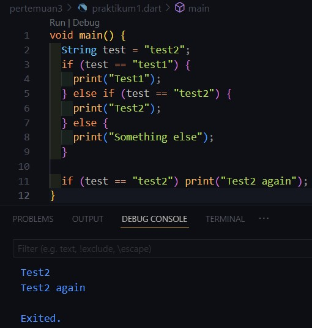
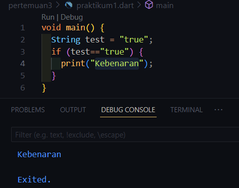
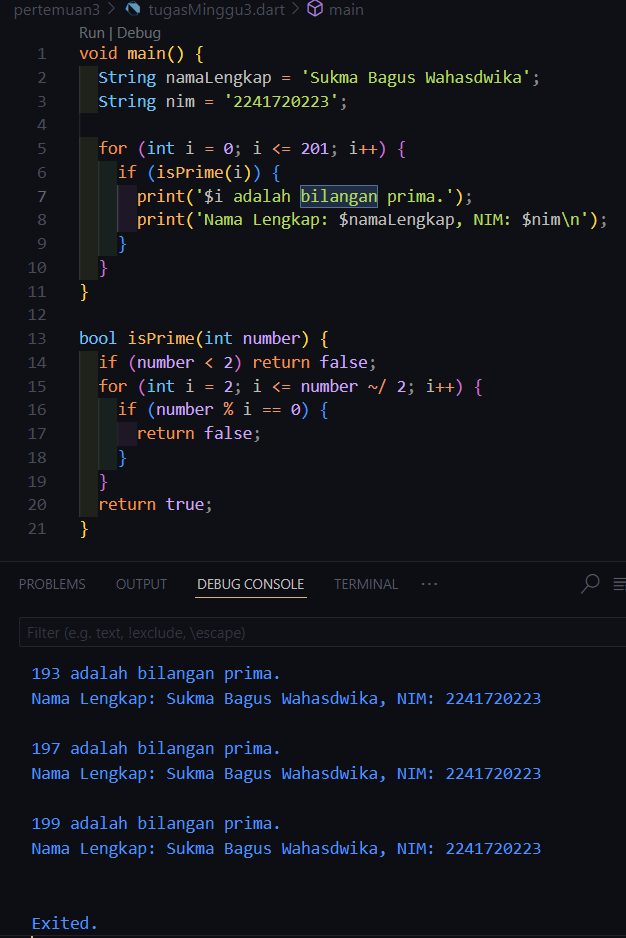

# Pemrograman_Mobile_2024-Pertemuan 3
**Pengantar Bahasa Pemrograman Dart - Bagian 2**
NIM     : 2241720223

NAMA    : Sukma Bagus Wahasdwika

# Praktikum 1 - Menerapkan Control Flows ("if/else")
1. **Langkah 1:**

2. **Langkah 2:**
Hasil eksekusi ada di langkah 1 yang menunjukkan bahwa output adalah "Test2 Test2 again", Ini terjadi sebab variabel 'String test=test2' saat kondisi if-else test == test2 dipanggil maka akan bernilai true.
3. **Langkah 3:**
Menambahkan kode program 
Kesalahan terjadi karena dalam Dart, variabel bertipe String tidak dapat langsung digunakan dalam kondisi if, yang mengharapkan ekspresi boolean (bool). Dalam kode tersebut, ‘test’ adalah sebuah String dengan nilai “true”, dan Dart tidak secara otomatis mengonversi String menjadi boolean.

Perbaikan dan tambahan kode program sebelumnya:

# Praktikum 2 - Menerapkan Perulangan "while" dan "do-while"

# Praktikum 3 - Menerapkan Perulangan "for" dan "break-continue"

# Tugas Praktikum
1. Silakan selesaikan Praktikum 1 sampai 3, lalu dokumentasikan berupa screenshot hasil pekerjaan beserta penjelasannya!
2. Buatlah sebuah program yang dapat menampilkan bilangan prima dari angka 0 sampai 201 menggunakan Dart. Ketika bilangan prima ditemukan, maka tampilkan nama lengkap dan NIM Anda.

Jawaban :

3. Kumpulkan berupa link commit repo GitHub pada tautan yang telah disediakan di grup Telegram!
