# Pemrograman_Mobile_2024-Pertemuan 4
**Pengantar Bahasa Pemrograman Dart - Bagian 3**

NIM     : 2241720223

NAMA    : Sukma Bagus Wahasdwika

# Praktikum 1 - Eksperimen Tipe Data List
1. **Langkah 1:**

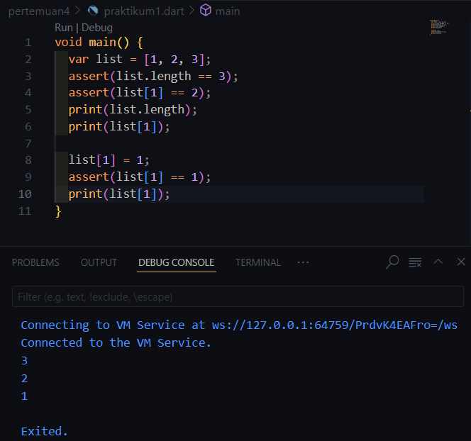

2. **Langkah 2:**

* var list = [1, 2, 3]; mendeklarasikan sebuah variabel bernama list yang berisi array (atau daftar) dengan elemen-elemen [1, 2, 3].

* assert(list.length == 3); adalah pernyataan yang memeriksa apakah panjang (length) dari list sama dengan 3. Karena daftar tersebut memiliki 3 elemen, kondisi ini benar dan program akan melanjutkan tanpa ada masalah.

* assert(list[1] == 2); memeriksa apakah elemen di indeks 1 dari list adalah 2. Indeks 1 pada daftar [1, 2, 3] memang memiliki nilai 2, sehingga pernyataan assert ini juga berhasil.

* print(list.length); dan print(list[1]); akan menampilkan panjang daftar dan elemen pada indeks 1. Jika semua kondisi assert benar, maka output yang dihasilkan akan menunjukkan 3, 2, dan 2.

3. **Langkah 3:**

Output dari program ini akan mencetak Nama dan NIM, yang merupakan isi dari elemen pada indeks 1 dan indeks 2 dari list. Jadi, hasilnya akan menunjukkan nilai yang tersimpan di kedua indeks tersebut.

Perbaikan dan tambahan kode program sebelumnya:

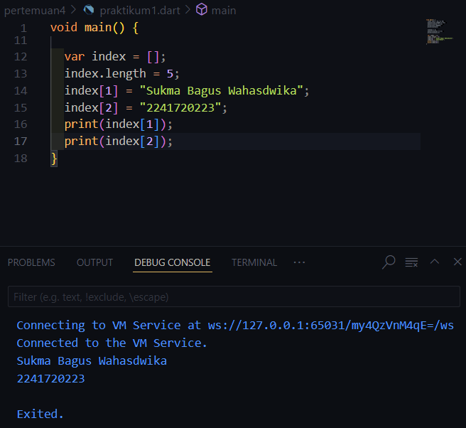

# Praktikum 2 - Eksperimen Tipe Data Set
1. **Langkah 1:**

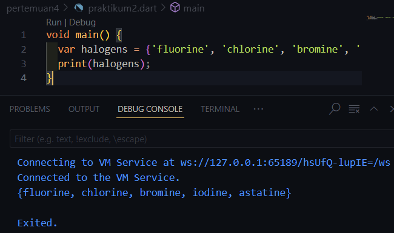

2. **Langkah 2:**

Isi list dari variabel halogens[], diprint maka akan keluar semua isi dari list tersebut.

3. **Langkah 3:**

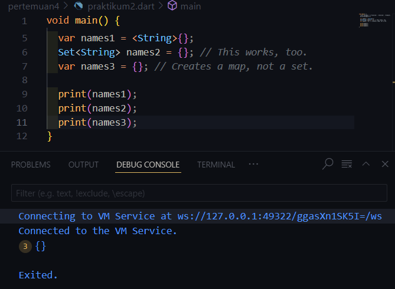

Jika Error yang terjadi output tersebut akan keluar '{}' sebanyak 3 kali sebab tidak ada nilai/data didalamnya. 


# Praktikum 3 - Experimen Tipe Data Maps
1. **Langkah 1:**

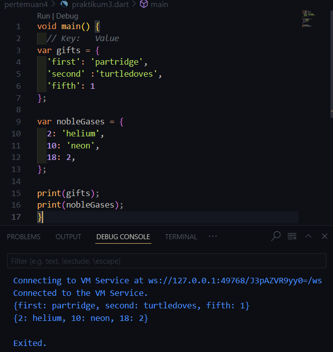

2. **Langkah 2:**

Yang terjadi adalah isi dari Map gifts dan nobleGases akan ditampilkan saat diprint. Dalam kode ini, baik gifts maupun nobleGases merupakan contoh Map dengan tipe kunci yang berbeda (string dan integer), serta nilai-nilai yang bervariasi (string dan integer).

3. **Langkah 3:**

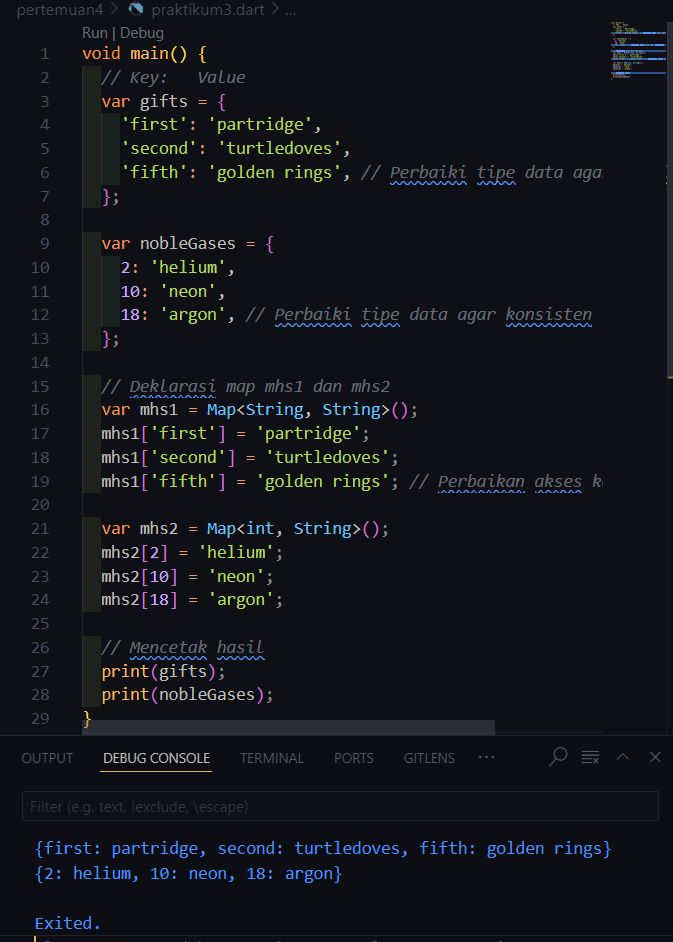

Yang terjadi adalah penambahan Map di dalam Map, di mana variabel mhs1 dan mhs2 ditambahkan dengan memasukkan Map gifts ke dalam mhs1 dan Map nobleGases ke dalam mhs2.

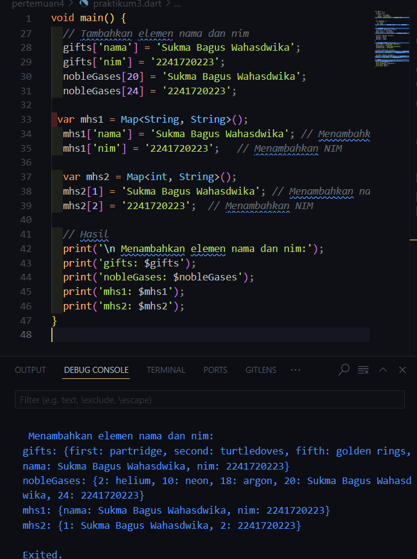

# Praktikum 4 - Experimen Tipe Data List: Spread dan Control-flow Operators
1. **Langkah 1:**


2. **Langkah 2:**

Terjadi error karena variabel list1 tidak didefinisikan, sehingga saat dijalankan menghasilkan kesalahan. Maksud dari kode di atas adalah:

print(list); digunakan untuk menampilkan isi dari list.
print(list2); akan menampilkan isi dari list2, yang menarik elemen dari list menggunakan sintaks ...list.
print(list2.length); menunjukkan panjang dari list2.

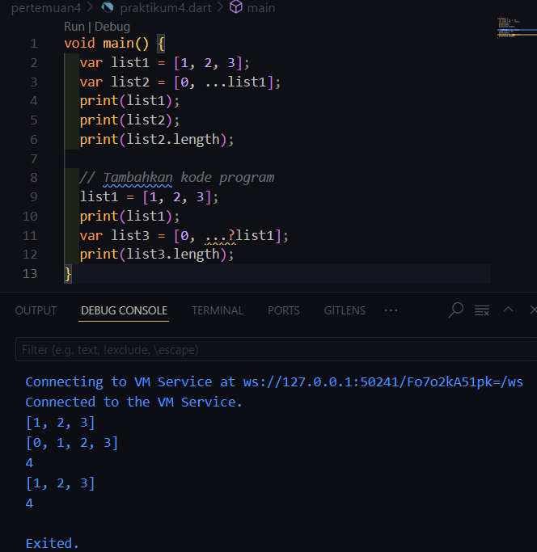

3. **Langkah 3:**

Terjadi error dengan penggunaan operator Spread (...?), yang digunakan untuk menangani situasi ketika seluruh list mungkin bernilai null. Namun, operator ini tidak menangani elemen yang bernilai null di dalam list. Jika list tersebut mengandung elemen null (seperti dalam kasus list1 = [1, 2, null]), maka Dart akan tetap menyebarkan elemen null ke dalam list3.

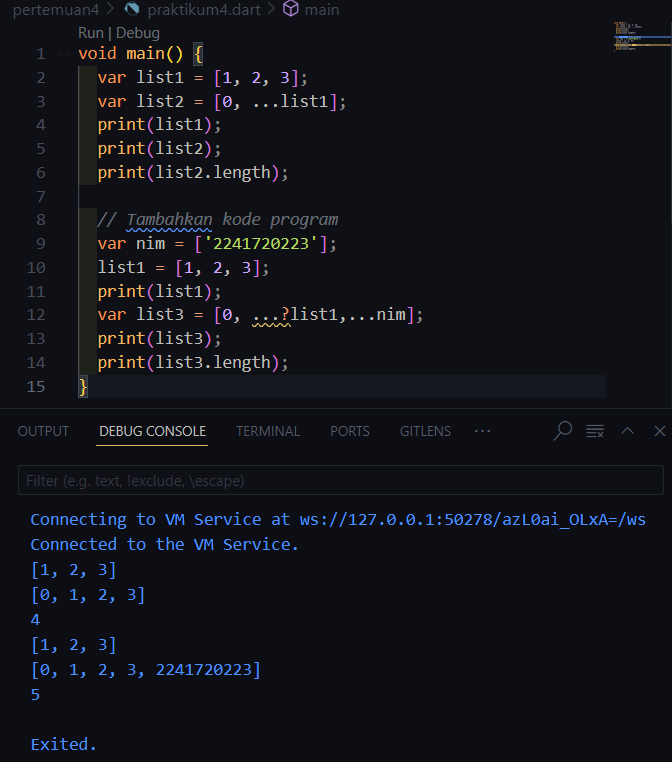

4. **Langkah 4:**

Error pada kode tersebut mungkin disebabkan oleh variabel promoActive yang belum didefinisikan. Dalam Dart, kamu dapat menggunakan ekspresi bersyarat if di dalam list untuk menyertakan item secara dinamis, tetapi variabel seperti promoActive harus dideklarasikan terlebih dahulu agar dapat digunakan.

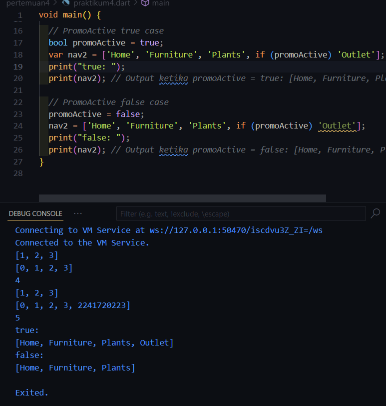

5. **Langkah 5:**

Error pada kode tersebut disebabkan oleh sintaks yang tidak tepat pada ekspresi bersyarat di dalam list. Ekspresi bersyarat if dalam list hanya dapat menggunakan ekspresi boolean untuk menentukan apakah item harus ditambahkan ke dalam list.

Dalam kode, if (login case 'Manager') tidak valid karena login case 'Manager' bukan merupakan ekspresi boolean. Kita harus menggunakan ekspresi yang menghasilkan nilai true atau false.

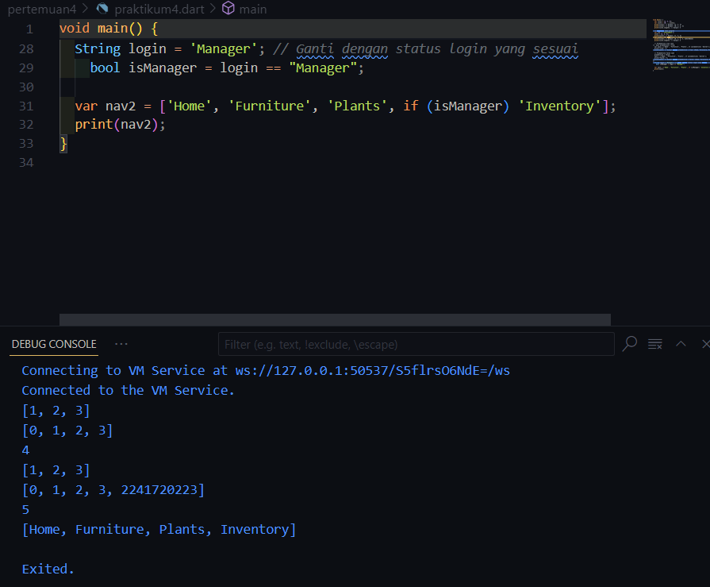

6. **Langkah 6:**

* ['#0'] : Dimulai dengan sebuah list yang berisi elemen pertama '#0'.

* for (var i in listOfInts) : Melakukan iterasi terhadap setiap elemen dalam listOfInts.

* '#$i' : Untuk setiap elemen dalam listOfInts, nilai elemen tersebut digabungkan dengan string '#' menggunakan sintaks $i, yang merupakan cara Dart untuk menyisipkan nilai variabel ke dalam string.

* Manfaat Collection: Fitur Collection for di Dart memungkinkan pembuatan koleksi (seperti list, set, atau map) dengan lebih efisien dan ringkas menggunakan struktur perulangan for.

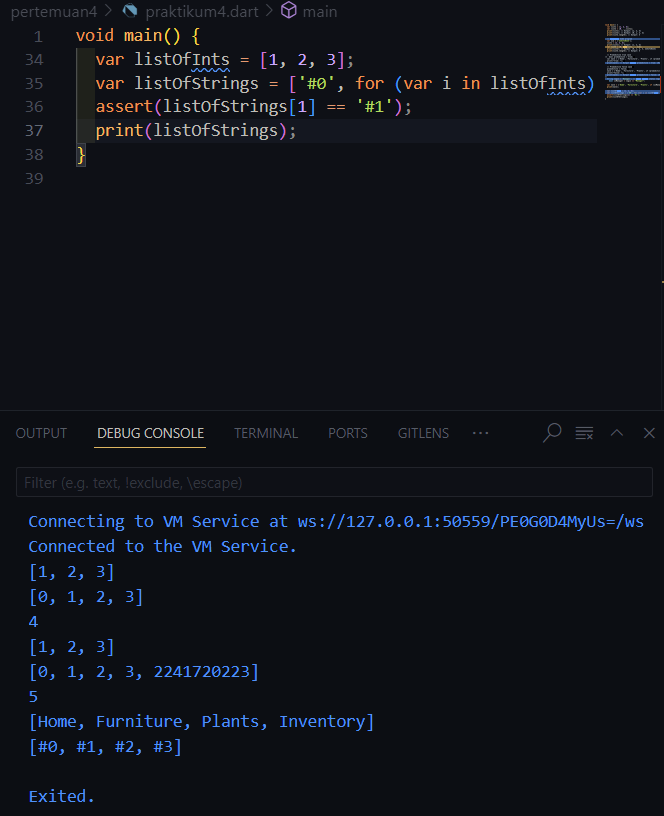

*NB:Hasil pada gambar diatas yang tercantum dari langkah 1-6 sudah diperbaiki, penjelasan tersebut merupakan dari percobaan kode yang telah dilakukan pada modul*

# Praktikum 5 - Experimen Tipe Data Records
1. **Langkah 1:**

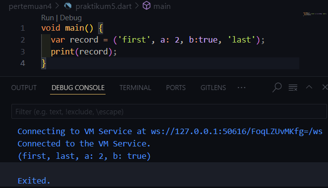

2. **Langkah 2:**

Yang terjadi adalah output dihasilkan dari variabel record. Dalam Dart, tipe data seperti tuple tidak mendukung penulisan label seperti a: 2 atau b: true di dalamnya. Oleh karena itu, untuk membuat tuple sederhana, kamu bisa menuliskannya seperti ini: var record = ('first', 2, true, 'last');.

3. **Langkah 3:**

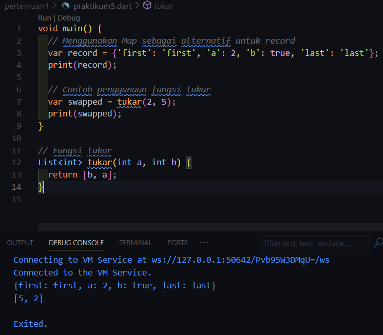

Sama seperti pada langkah 1, karena seharusnya fungsi tukar dipanggil dalam main() agar dapat berfungsi dengan baik.

4. **Langkah 4:**

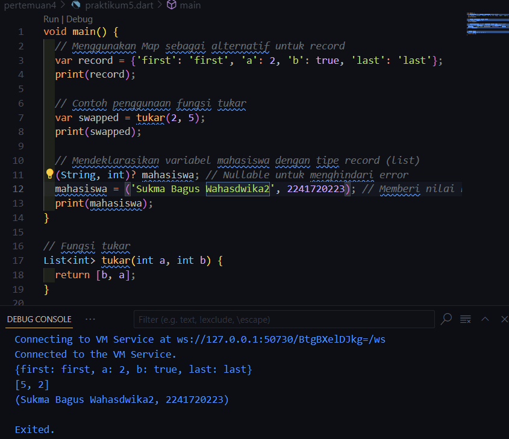

* Variabel mahasiswa dideklarasikan tanpa inisialisasi, yang menyebabkan error.
Solusi:

* Menginisialisasi variabel mahasiswa dengan nilai yang sesuai.
Hasil:

* Kode yang diperbaiki berhasil dijalankan dan mengeluarkan output yang diharapkan pada screenshot hasil pada langkah 4.

5. **Langkah 5:**

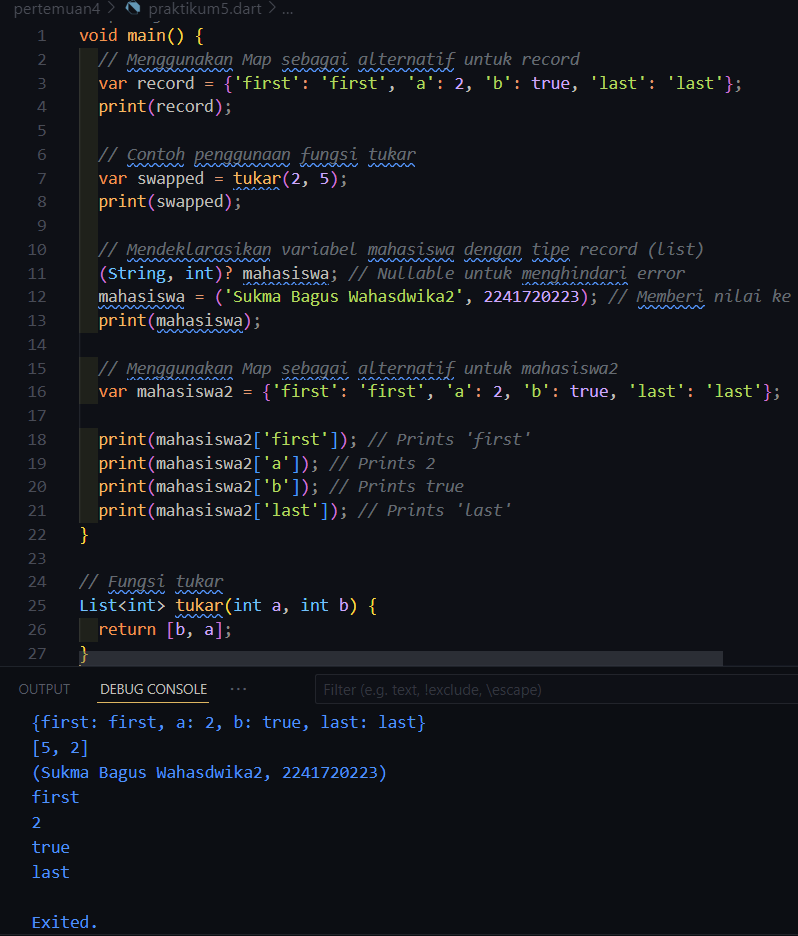

Dalam Dart, sintaks yang digunakan untuk mendeklarasikan mahasiswa2 dengan elemen berlabel (a: 2 dan b: true) tidak valid, karena Dart tidak mendukung penulisan label di dalam tuple. Sebagai gantinya maka, menggunakan list atau map untuk mencapai hal tersebut.
* Deklarasi dan Inisialisasi:
Variabel mahasiswa2 dideklarasikan sebagai tuple yang berisi nama, NIM, status (boolean), dan elemen lain.
* Mengakses Elemen:
print(mahasiswa2.$1);, print(mahasiswa2.$2);, print(mahasiswa2.$3);, dan print(mahasiswa2.$4); digunakan untuk mengakses elemen-elemen dari tuple.
* Mengganti Isi Record:
Setelah inisialisasi awal, salah satu isi dari mahasiswa2 diganti dengan nama dan NIM baru.

# Tugas Praktikum
1. Silakan selesaikan Praktikum 1 sampai 5, lalu dokumentasikan berupa screenshot hasil pekerjaan Anda beserta penjelasannya!
    **JAWABAN:** Praktikum 1 sampai 5 telah dilaksanakan dan didokumentasikan serta penjelasan disetiap percobaan.

2. Jelaskan yang dimaksud Functions dalam bahasa Dart!
    **JAWABAN:** Fungsi dalam bahasa Dart adalah sekumpulan kode yang dapat digunakan kembali untuk melaksanakan tugas tertentu. Penggunaan fungsi membantu dalam mengorganisir kode, menghindari pengulangan, dan meningkatkan modularitas program. Di Dart, fungsi bisa menerima parameter dan mengembalikan nilai, meskipun ada juga fungsi yang tidak mengembalikan nilai atau tidak memerlukan parameter.

3. Jelaskan jenis-jenis parameter di Functions beserta contoh sintaksnya!
    **JAWABAN:**
    * Positional Parameters
        Positional parameters adalah parameter yang posisinya menentukan nilai yang harus diberikan saat fungsi dipanggil. Parameter ini bersifat wajib dan tidak dapat dilewati.

        *contoh:*

        ```dart

            void printInfo(String name, int age) {

        print('Name: $name, Age: $age');

        }

        void main() {

        printInfo('Bagus', 20); // Output: Name: Bagus, Age: 20

        }
        ```

    * Named Parameters
        Named parameters memberikan lebih banyak fleksibilitas dalam pemanggilan fungsi. Mereka memungkinkan kita untuk menyebutkan nama parameter saat memanggil fungsi, sehingga urutan argumen tidak penting. Named parameters bersifat opsional kecuali ditandai dengan required.

        *contoh:*

        ```dart
        void printInfo({required String name, required int age}) {
        print('Name: $name, Age: $age');
        }

        void main() {
        printInfo(name: 'Bagus', age: 20); // Output: Name: Bagus, Age: 20
        }
        ```

    * Optional Positional Parameters
        Optional positional parameters memungkinkan kita untuk mendefinisikan parameter yang tidak wajib diisi. Jika tidak diberikan, mereka akan memiliki nilai null secara default (jika tipe datanya nullable).

        *contoh:*
        
        ```dart
        void printInfo(String name, [int? age]) {
        if (age != null) {
            print('Name: $name, Age: $age');
        } else {
            print('Name: $name, Age: unknown');
        }
        }

        void main() {
        printInfo('Bagus');         // Output: Name: Bagus, Age: unknown
        printInfo('Bagus', 20);     // Output: Name: Bagus, Age: 20
        }
        ```

    * Default Parameters
        Default parameters adalah parameter opsional yang memiliki nilai default. Jika nilai tidak disediakan saat memanggil fungsi, parameter ini akan menggunakan nilai default yang telah ditentukan.

        *contoh:*
        ```dart
        void printInfo(String name, [int age = 19]) {
        print('Name: $name, Age: $age');
        }

        void main() {
        printInfo('Bagus');         // Output: Name: Bagus, Age: 19
        printInfo('Bagus', 20);     // Output: Name: Bagus, Age: 20
        }
        ``` 

    * Combined Example: Positional, Named, and Optional Parameters
        Menggabungkan berbagai jenis parameter dalam satu fungsi, tetapi ada aturan bahwa positional parameters harus dideklarasikan sebelum optional parameters.

        *contoh:*

        ```dart
        void printInfo(String name, {int age = 19, String? hobby}) {
        print('Name: $name, Age: $age, Hobby: ${hobby ?? 'unknown'}');
        }

        void main() {
        printInfo('Bagus');                         // Output: Name: Bagus, Age: 19, Hobby: unknown
        printInfo('Bagus', age: 20);                // Output: Name: Bagus, Age: 20, Hobby: unknown
        printInfo('Bagus', age: 20, hobby: 'Swimming'); // Output: Name: Bagus, Age: 20, Hobby: Swimming
        }
        ```


4. Jelaskan maksud Functions sebagai first-class objects beserta contoh sintaknya!
    **JAWABAN:** Dalam Dart, fungsi dipandang sebagai objek kelas satu, yang berarti fungsi dapat diperlakukan seperti objek lainnya. Ini berarti bahwa fungsi dapat:

    * Disimpan dalam variabel.
    * Diteruskan sebagai argumen ke fungsi lain.
    * Dikembalikan sebagai nilai dari fungsi lain.
    * Disimpan dalam struktur data seperti list atau map.
    CONTOH:

    ```dart
    void sapa(String name) {
    print('Hello, $name!');
    }

    void main() {
    var greet = sapa;  // Menyimpan fungsi sapa ke dalam variabel greet
    greet('Bagus');   // Memanggil fungsi melalui variabel
    }
    ```

    Kemampuan ini memberikan fleksibilitas tinggi dalam penulisan kode, karena fungsi dapat dimanipulasi dan digunakan layaknya data lainnya.


5. Apa itu Anonymous Functions? Jelaskan dan berikan contohnya!
    **JAWABAN:** Fungsi anonim, atau dikenal sebagai anonymous function atau lambda function, adalah fungsi yang dideklarasikan tanpa nama. Biasanya, fungsi ini digunakan dalam situasi di mana fungsinya hanya dipakai sekali, seperti untuk operasi yang tidak berulang atau ketika digunakan sebagai argumen untuk fungsi lain.

    Sintaks fungsi anonim di Dart: Fungsi anonim ditulis dengan tanda kurung ( ) diikuti oleh { } yang berisi isi fungsi. Fungsi ini juga dapat menerima parameter seperti halnya fungsi biasa.

    Struktur umum fungsi anonim:
    ```dart
    (parameter1, parameter2, ...) {
    // Badan fungsi
    }
    ```

6. Jelaskan perbedaan Lexical scope dan Lexical closures! Berikan contohnya!
    **JAWABAN:**
    - Lexical Scope

        Lexical scope adalah aturan yang menentukan bagaimana variabel dalam suatu fungsi atau blok kode bisa diakses berdasarkan tempat di mana fungsi atau blok kode tersebut dideklarasikan. Dengan kata lain, lexical scope mengacu pada fakta bahwa variabel hanya dapat diakses di dalam blok di mana mereka dideklarasikan, serta di dalam fungsi yang berada di dalam blok tersebut.

        Dalam lexical scope, sebuah fungsi dapat mengakses variabel yang dideklarasikan dalam scope di sekitarnya, yaitu di blok atau fungsi yang mendeklarasikan fungsi tersebut.

        *Contoh Lexical Scope:*

        ```dart
        void main() {
        int x = 10;

        void printX() {
            print(x);  // Fungsi ini dapat mengakses variabel 'x' karena berada dalam scope di luar fungsi ini
        }

        printX();  // Output: 10
        }
        ```
    - Lexical Closures
        
        Penutupan Leksikal (Lexical Closure) adalah konsep di mana sebuah fungsi dapat "menyimpan" atau "membawa" variabel dari lingkup leksikal di sekitarnya, bahkan setelah konteks di mana variabel tersebut dideklarasikan telah selesai dieksekusi. Closure "mengikat" variabel-variabel dari lingkup tempat fungsi tersebut dideklarasikan, sehingga variabel tersebut tetap tersedia saat fungsi dipanggil nanti, meskipun lingkup eksternal tersebut sudah tidak aktif atau sudah selesai dieksekusi.

        Dengan kata lain, closure memungkinkan fungsi untuk mengingat dan menggunakan variabel dari lingkup di luar fungsi, walaupun lingkup tersebut sudah tidak ada atau tidak aktif lagi.

        *Contoh Penutupan Leksikal:*

        ```dart
        Function createAdder(int x) {
        return (int y) => x + y;  // Fungsi ini "menutup" variabel 'x' dari scope di luar fungsi ini
        }

        void main() {
        var addTen = createAdder(10);
        print(addTen(5));  // Output: 15
        }
        ```

7. Jelaskan dengan contoh cara membuat return multiple value di Functions!
    **JAWABAN:**
    - Menggunakan Tuple (Record)
        Dart mendukung penggunaan record untuk mengembalikan beberapa nilai sekaligus. Dengan menggunakan record, dapat mengembalikan beberapa nilai dalam satu struktur tanpa perlu membuat kelas atau objek. Mendeklarasikan dan mengembalikan nilai-nilai yang diinginkan dalam bentuk record.

        *Contoh penggunaan record:*

        ```dart
        // Mendefinisikan fungsi yang mengembalikan record
        (String, int) getUserInfo() {
        return ('Bagus Wahasdwika', 2241720223);
        }

        void main() {
        var userInfo = getUserInfo(); // Memanggil fungsi

        // Mengakses nilai dari record
        print('Nama: ${userInfo.$1}'); // Output: Nama: Bagus Wahasdwika
        print('NIM: ${userInfo.$2}');   // Output: NIM: 2241720223
        }
        ```
    - Menggunakan List
        Bisa mengembalikan beberapa nilai dalam bentuk list. Meskipun list biasanya digunakan untuk menyimpan koleksi data, ini juga merupakan cara yang efektif untuk mengembalikan beberapa nilai dari sebuah fungsi.

        *Kode Menggunakan List:*

        ```dart
        List<dynamic> calculateValues() {
        int sum = 5 + 10;
        double average = sum / 2;

        return [sum, average]; // Mengembalikan list dengan dua nilai
        }

        void main() {
        var results = calculateValues(); // Memanggil fungsi

        print('Jumlah: ${results[0]}');    // Output: Jumlah: 15
        print('Rata-rata: ${results[1]}');  // Output: Rata-rata: 7.5
        }
        ```
    - Menggunakan Object
        Cara yang paling umum dan jelas untuk mengembalikan beberapa nilai dari sebuah fungsi adalah dengan menggunakan objek. Dan juga bisa membuat sebuah kelas untuk mengemas beberapa nilai yang ingin dikembalikan.

        *Contoh Penggunaan Objek:*

        ```dart
        class User {
        String name;
        int nim;

        User(this.name, this.nim); // Constructor untuk inisialisasi
        }

        User getUser() {
        return User('Bagus Wahasdwika', 2241720223); // Mengembalikan objek User
        }

        void main() {
        var user = getUser(); // Memanggil fungsi

        print('Nama: ${user.name}'); // Output: Nama: Bagus Wahasdwika
        print('NIM: ${user.nim}');    // Output: NIM: 2241720223
        }
        ```
    - Menggunakan Map
        Menggunakan Map untuk mengembalikan beberapa nilai dengan kunci yang jelas.

        *Contoh Menggunakan Map:*

        ```dart
        Map<String, dynamic> getStudentData() {
        return {
            'name': 'Bagus Wahasdwika',
            'nim': 2241720223,
            'status': 'active'
        };
        }

        void main() {
        var studentData = getStudentData(); // Memanggil fungsi

        print('Nama: ${studentData['name']}'); // Output: Nama: Bagus Wahasdwika
        print('NIM: ${studentData['nim']}');    // Output: NIM: 2241720223
        print('Status: ${studentData['status']}'); // Output: Status: active
        }
        ``` 

8. Kumpulkan berupa link commit repo GitHub pada tautan yang telah disediakan di grup Telegram!
