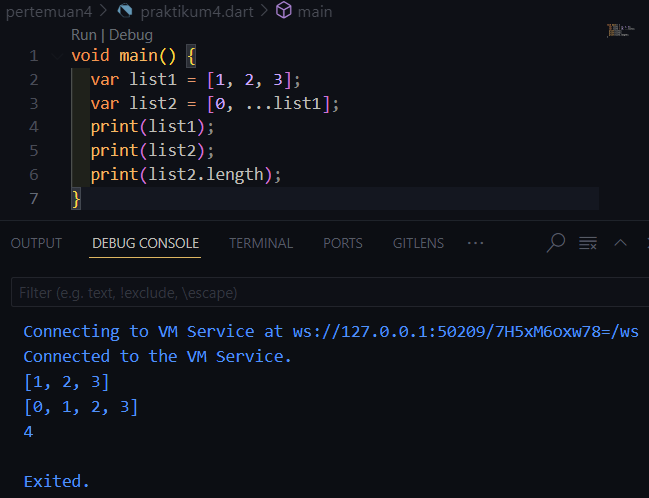

# Pemrograman_Mobile_2024-Pertemuan 4
**Pengantar Bahasa Pemrograman Dart - Bagian 3**

NIM     : 2241720223

NAMA    : Sukma Bagus Wahasdwika

# Praktikum 1 - Eksperimen Tipe Data List
1. **Langkah 1:**

2. **Langkah 2:**

* var list = [1, 2, 3]; mendeklarasikan sebuah variabel bernama list yang berisi array (atau daftar) dengan elemen-elemen [1, 2, 3].

* assert(list.length == 3); adalah pernyataan yang memeriksa apakah panjang (length) dari list sama dengan 3. Karena daftar tersebut memiliki 3 elemen, kondisi ini benar dan program akan melanjutkan tanpa ada masalah.

* assert(list[1] == 2); memeriksa apakah elemen di indeks 1 dari list adalah 2. Indeks 1 pada daftar [1, 2, 3] memang memiliki nilai 2, sehingga pernyataan assert ini juga berhasil.

* print(list.length); dan print(list[1]); akan menampilkan panjang daftar dan elemen pada indeks 1. Jika semua kondisi assert benar, maka output yang dihasilkan akan menunjukkan 3, 2, dan 2.

3. **Langkah 3:**

Output dari program ini akan mencetak Nama dan NIM, yang merupakan isi dari elemen pada indeks 1 dan indeks 2 dari list. Jadi, hasilnya akan menunjukkan nilai yang tersimpan di kedua indeks tersebut.

Perbaikan dan tambahan kode program sebelumnya:

# Praktikum 2 - Eksperimen Tipe Data Set
1. **Langkah 1:**

2. **Langkah 2:**

Isi list dari variabel halogens[], diprint maka akan keluar semua isi dari list tersebut.

3. **Langkah 3:**

Jika Error yang terjadi output tersebut akan keluar '{}' sebanyak 3 kali sebab tidak ada nilai/data didalamnya. 

# Praktikum 3 - Experimen Tipe Data Maps
1. **Langkah 1:**

2. **Langkah 2:**

Yang terjadi adalah isi dari Map gifts dan nobleGases akan ditampilkan saat diprint. Dalam kode ini, baik gifts maupun nobleGases merupakan contoh Map dengan tipe kunci yang berbeda (string dan integer), serta nilai-nilai yang bervariasi (string dan integer).

3. **Langkah 3:**

Yang terjadi adalah penambahan Map di dalam Map, di mana variabel mhs1 dan mhs2 ditambahkan dengan memasukkan Map gifts ke dalam mhs1 dan Map nobleGases ke dalam mhs2.

# Praktikum 4 - Experimen Tipe Data List: Spread dan Control-flow Operators
1. **Langkah 1:**

2. **Langkah 2:**

Terjadi error karena variabel list1 tidak didefinisikan, sehingga saat dijalankan menghasilkan kesalahan. Maksud dari kode di atas adalah:

print(list); digunakan untuk menampilkan isi dari list.
print(list2); akan menampilkan isi dari list2, yang menarik elemen dari list menggunakan sintaks ...list.
print(list2.length); menunjukkan panjang dari list2.

3. **Langkah 3:**

Terjadi error dengan penggunaan operator Spread (...?), yang digunakan untuk menangani situasi ketika seluruh list mungkin bernilai null. Namun, operator ini tidak menangani elemen yang bernilai null di dalam list. Jika list tersebut mengandung elemen null (seperti dalam kasus list1 = [1, 2, null]), maka Dart akan tetap menyebarkan elemen null ke dalam list3.

4. **Langkah 4:**

Error pada kode tersebut mungkin disebabkan oleh variabel promoActive yang belum didefinisikan. Dalam Dart, kamu dapat menggunakan ekspresi bersyarat if di dalam list untuk menyertakan item secara dinamis, tetapi variabel seperti promoActive harus dideklarasikan terlebih dahulu agar dapat digunakan.

5. **Langkah 5:**

Error pada kode tersebut disebabkan oleh sintaks yang tidak tepat pada ekspresi bersyarat di dalam list. Ekspresi bersyarat if dalam list hanya dapat menggunakan ekspresi boolean untuk menentukan apakah item harus ditambahkan ke dalam list.

Dalam kode, if (login case 'Manager') tidak valid karena login case 'Manager' bukan merupakan ekspresi boolean. Kita harus menggunakan ekspresi yang menghasilkan nilai true atau false.

6. **Langkah 6:**

* ['#0'] : Dimulai dengan sebuah list yang berisi elemen pertama '#0'.

* for (var i in listOfInts) : Melakukan iterasi terhadap setiap elemen dalam listOfInts.

* '#$i' : Untuk setiap elemen dalam listOfInts, nilai elemen tersebut digabungkan dengan string '#' menggunakan sintaks $i, yang merupakan cara Dart untuk menyisipkan nilai variabel ke dalam string.

* Manfaat Collection: Fitur Collection for di Dart memungkinkan pembuatan koleksi (seperti list, set, atau map) dengan lebih efisien dan ringkas menggunakan struktur perulangan for.

*NB:Hasil pada gambar diatas yang tercantum dari langkah 1-6 sudah diperbaiki, penjelasan tersebut merupakan dari percobaan kode yang telah dilakukan pada modul*

# Praktikum 5 - Experimen Tipe Data Records
1. **Langkah 1:**

2. **Langkah 2:**

Yang terjadi adalah output dihasilkan dari variabel record. Dalam Dart, tipe data seperti tuple tidak mendukung penulisan label seperti a: 2 atau b: true di dalamnya. Oleh karena itu, untuk membuat tuple sederhana, kamu bisa menuliskannya seperti ini: var record = ('first', 2, true, 'last');.

3. **Langkah 3:**

Sama seperti pada langkah 1, karena seharusnya fungsi tukar dipanggil dalam main() agar dapat berfungsi dengan baik.

4. **Langkah 4:**

* Variabel mahasiswa dideklarasikan tanpa inisialisasi, yang menyebabkan error.
Solusi:

* Menginisialisasi variabel mahasiswa dengan nilai yang sesuai.
Hasil:

* Kode yang diperbaiki berhasil dijalankan dan mengeluarkan output yang diharapkan pada screenshot hasil pada langkah 4.

5. **Langkah 5:**

Dalam Dart, sintaks yang digunakan untuk mendeklarasikan mahasiswa2 dengan elemen berlabel (a: 2 dan b: true) tidak valid, karena Dart tidak mendukung penulisan label di dalam tuple. Sebagai gantinya maka, menggunakan list atau map untuk mencapai hal tersebut.
* Deklarasi dan Inisialisasi:
Variabel mahasiswa2 dideklarasikan sebagai tuple yang berisi nama, NIM, status (boolean), dan elemen lain.
* Mengakses Elemen:
print(mahasiswa2.$1);, print(mahasiswa2.$2);, print(mahasiswa2.$3);, dan print(mahasiswa2.$4); digunakan untuk mengakses elemen-elemen dari tuple.
* Mengganti Isi Record:
Setelah inisialisasi awal, salah satu isi dari mahasiswa2 diganti dengan nama dan NIM baru.

# Tugas Praktikum
1. Silakan selesaikan Praktikum 1 sampai 5, lalu dokumentasikan berupa screenshot hasil pekerjaan Anda beserta penjelasannya!
2. Jelaskan yang dimaksud Functions dalam bahasa Dart!
3. Jelaskan jenis-jenis parameter di Functions beserta contoh sintaksnya!
4. Jelaskan maksud Functions sebagai first-class objects beserta contoh sintaknya!
5. Apa itu Anonymous Functions? Jelaskan dan berikan contohnya!
6. Jelaskan perbedaan Lexical scope dan Lexical closures! Berikan contohnya!
7. Jelaskan dengan contoh cara membuat return multiple value di Functions!
8. Kumpulkan berupa link commit repo GitHub pada tautan yang telah disediakan di grup Telegram!